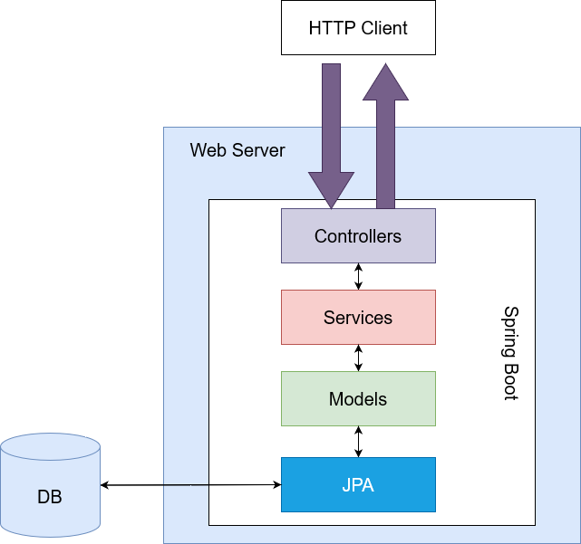

<h2>VACINATEC API REST</h2>

## Adrs Aceitas

* [DR-002 - Proposta-Cliente-Servidor](adrs/aceitas/ADR-002-Proposta-Cliente-Servidor.md)
* [ADR-003 - Decisão-Atributos-Foco](adrs/aceitas/ADR-003-Decisão-Atributos-Foco.md)
* [ADR-004 - Princípios-Design](adrs/aceitas/ADR-004-Princípios-Design.md)
* [ADR-005 - Adoção-Controle-Versionamento](adrs/aceitas/ADR-005-Adoção-Controle-Versionamento.md)
* [ADR-006 - tatica-disponibilidade](adrs/aceitas/ADR-006-tatica-disponibilidade.md)
* [ADR007 - taticas-usablilidade](adrs/aceitas/ADR007-taticas-usablilidade.md)
* [DR-002 - Proposta-Cliente-Servidor](adrs/aceitas/ADR-002-Proposta-Cliente-Servidor.md)
* [ADR008 - Modificabilidade](adrs/aceitas/ADR-002-Proposta-Cliente-Servidor.md)
* [ADR009 - Desenvolvimento da API](adrs/aceitas/ADR9:Desenvolvimento-da-API.md)
* [ADR010 - Desenvolvimento do cliente](adrs/aceitas/ADR10Desenvolvimento-do-cliente.md)



### Objetivos

* Setup inicial de projeto com o Spring Boot Initialzr 
* Criação de modelo de dados para o mapeamento de entidades em bancos de dados
* Desenvolvimento de operações de gerenciamento de usuários (Cadastro, leitura, atualização e remoção de pessoas de um sistema).

Para executar o projeto no terminal, digite o seguinte comando:

```shell script
mvn spring-boot:run 
```

Após executar o comando acima, basta apenas abrir o seguintes endereços e visualizar a execução do projeto:

```
http://localhost:8080/api/v1/person
http://localhost:8080/api/v1/vaccine
http://localhost:8080/api/v1/vaccination
http://localhost:8080/api/v1/auth
```


São necessários os seguintes pré-requisitos para a execução do projeto desenvolvido durante a aula:

* Java 11 ou versões superiores.
* Maven 3.6.3 ou versões superiores.
* Intellj IDEA Community Edition ou sua IDE favorita.
* Controle de versão GIT instalado na sua máquina.
